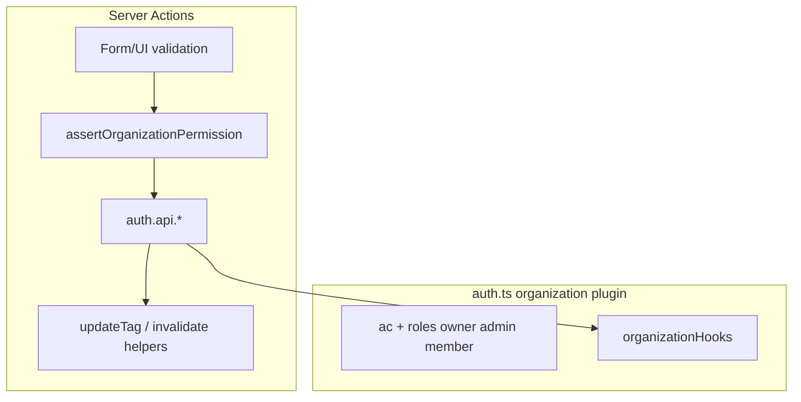

# استانداردسازی org/team/member با Better Auth

## انجام‌شده: enumهای Prisma (پیش‌نیاز)

همه enumهای auth schema به **lowercase** هم‌راستا با Better Auth:

| Enum | مقادیر |
|------|--------|
| `MembershipRole` | `owner`, `admin`, `member` |
| `NotificationType` | `system`, `organization`, `security`, `custom` |
| `NotificationAudience` | `user_direct`, `org_all`, `org_admins`, `org_members`, `team` |
| `UserRole` | بدون تغییر (`user`, `admin`) |

- Schema: [`prisma/better-auth.prisma`](prisma/better-auth.prisma)
- Migration: [`prisma/migrations/20260601120000_lowercase_auth_enums/migration.sql`](prisma/migrations/20260601120000_lowercase_auth_enums/migration.sql) — `ALTER TYPE ... RENAME VALUE`
- اپ، badge، seed به‌روز شد؛ `pnpm exec prisma generate` اجرا شود بعد از pull

**قبل از dev:** `pnpm exec prisma migrate deploy` (یا `migrate dev`) روی DB.

---

## هدف (مرحله بعد)

یک منبع حقیقت برای **mutate** و **authorization** سازمان/تیم/عضو: پلاگین organization در [`src/lib/auth/auth.ts`](src/lib/auth/auth.ts) + `auth.api` در اکشن‌ها. **خارج از scope:** منطق دعوت‌نامه (لینک shareable، `maxUses`, Prisma مستقیم) — فقط چک دسترسی هم‌راستا می‌شود.



## نقش‌ها و Better Auth

DB و TypeScript از enumهای lowercase استفاده می‌کنند — **همان** نام‌های پیش‌فرض Better Auth (`owner`, `admin`, `member`).

- در `organization-permissions.ts`: `defaultStatements` + `ownerAc` / `adminAc` / `memberAc` با کلیدهای `owner`, `admin`, `member` (بدون mapping اضافه).
- در پلاگین: `creatorRole: "owner"`.
- **بدون** auth client (پروژه server-only).

## فایل‌های جدید (حداقل)

| فایل | نقش |
|------|-----|
| [`src/lib/auth/organization-permissions.ts`](src/lib/auth/organization-permissions.ts) | `createAccessControl`, `ac`, export `roles` |
| [`src/lib/auth/organization-hooks.ts`](src/lib/auth/organization-hooks.ts) | `organizationHooks` — policy مشترک |
| [`src/lib/auth/organization-access.ts`](src/lib/auth/organization-access.ts) | `assertOrganizationPermission`, `getActorOrganizationRoleForManage` |

[`src/lib/auth/auth.ts`](src/lib/auth/auth.ts):

```ts
organization({
  ac,
  roles: { owner, admin, member },
  creatorRole: "owner",
  teams: { enabled: true },
  organizationHooks,
});
```

### `organization-hooks.ts`

| Hook | منطق |
|------|------|
| `beforeUpdateMemberRole` | فقط owner → owner؛ admin و owner rules؛ آخرین owner |
| `beforeRemoveMember` | آخرین owner؛ self-remove (مگر platform admin) |
| `beforeAddTeamMember` | user عضو org باشد |

مقایسه نقش در hooks با `"owner"` / `"admin"` / `"member"`. Platform admin در hooks bypass.

### اکشن‌ها → `auth.api`

همان جدول قبلی: `updateOrganization`, team CRUD, `addTeamMember`/`removeTeamMember`, `updateMemberRole`, `removeMember`, `set-organization-member-teams` via API loops.

## دعوت‌نامه / نوتیفیکیشن

Prisma mutate بدون تغییر؛ فقط `assertOrganizationPermission` به‌جای `canManageOrganization`.

## تمیزکاری

- حذف `organization-member-guards.ts` پس از انتقال به hooks + `organization-access.ts`
- حذف `canManageOrganization`

## تست دستی

- نقش‌های lowercase در UI و DB
- migrate روی DB dev
- سپس سناریوهای manage + invitations
