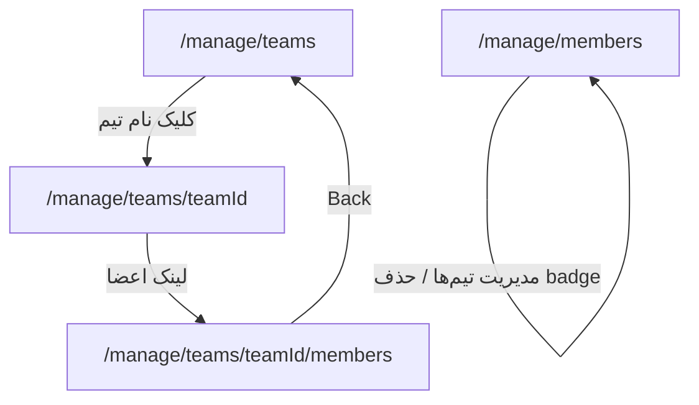

# مدیریت تیم‌ها و اعضای سازمان

## وضعیت فعلی

| بخش                                                                                      | وضعیت                                                                                                                                       |
| ---------------------------------------------------------------------------------------- | ------------------------------------------------------------------------------------------------------------------------------------------- |
| [`manage/members`](src/app/dashboard/organizations/[organizationId]/manage/members/)     | فقط لیست + `teamCount` — بدون mutation                                                                                                      |
| [`manage/teams`](src/app/dashboard/organizations/[organizationId]/manage/teams/page.tsx) | فقط لیست + جدول تشخیصی «outsider» — داده inline بدون `get-*`                                                                                |
| Actions                                                                                  | فقط invitations / notifications؛ **هیچ** action برای team/member                                                                            |
| Better Auth                                                                              | `teams: { enabled: true }` در [`auth.ts`](src/lib/auth.ts) — APIهای `createTeam`, `addTeamMember`, `removeMember`, … آماده اما استفاده نشده |

## معماری پیشنهادی (استاندارد قالب)

به‌جای مسیر جداگانه `/manage/users` (در breadcrumb ذکر شده ولی پیاده‌نشده)، **مدیریت «کاربر» در سطح سازمان = ردیف `Member`** است: نقش، حذف از org، مدیریت تیم‌ها. این با SaaSهای رایج (GitHub org, Linear workspace) هم‌خوان است.

### مسیرها ([`dashboard-routes.ts`](src/app/dashboard/lib/dashboard-routes.ts))

| مسیر                             | نقش                                                                      |
| -------------------------------- | ------------------------------------------------------------------------ |
| `/manage/teams`                  | جدول تیم‌ها (مرتب‌سازی نام `asc`) + دکمه «Add team» + کلیک ردیف → جزئیات |
| `/manage/teams/[teamId]`         | هدر تیم، ویرایش نام، حذف تیم، لینک به اعضا، دکمه بازگشت به لیست          |
| `/manage/teams/[teamId]/members` | جدول اعضای تیم (مثل org members) + افزودن چند نفر + حذف                  |
| `/manage/members`                | همان صفحه با **ManagementPanel** + ستون تیم‌ها + row actions             |

`getActiveOrganizationManageTab` با `pathname.includes('/manage/teams')` تب Teams را برای مسیرهای nested هم فعال نگه می‌دارد ([`organization-manage-nav-items.ts`](src/app/dashboard/lib/sidebar/organization-manage-nav-items.ts)).

### Layout امنیت

[`teams/[teamId]/layout.tsx`](src/app/dashboard/organizations/[organizationId]/manage/teams/) (جدید): `notFound()` اگر `team.organizationId !== organizationId`. والد [`manage/layout.tsx`](src/app/dashboard/organizations/[organizationId]/manage/layout.tsx) همان `requireOrganizationManageAccess` را دارد.

---

## لایه داده و cache

### استخراج loader تیم‌ها

انتقال منطق [`teams/page.tsx`](src/app/dashboard/organizations/[organizationId]/manage/teams/page.tsx) به:

- [`teams/lib/get-organization-teams-page.ts`](src/app/dashboard/organizations/[organizationId]/manage/teams/lib/get-organization-teams-page.ts) — `'use cache'` + `organizationTeamsById`
- [`teams/lib/teams-table-params.ts`](src/app/dashboard/organizations/[organizationId]/manage/teams/lib/teams-table-params.ts) — pagination (اختیاری؛ اگر تیم‌ها کم‌اند می‌توان بدون page شروع کرد)

### Loader اعضای تیم

- [`teams/[teamId]/members/lib/get-organization-team-members-page.ts`](src/app/dashboard/organizations/[organizationId]/manage/teams/[teamId]/members/lib/get-organization-team-members-page.ts)
- نوع: `OrganizationTeamMemberItem` — userId, name, email, image, `joinedAt` از `TeamMember.createdAt`

### گسترش loader اعضای سازمان

در [`get-organization-members-page.ts`](src/app/dashboard/organizations/[organizationId]/manage/members/lib/get-organization-members-page.ts):

- جایگزینی `teamCount` با `teams: { id, name }[]` (یک query `teamMember` با `team.organizationId`)

### Cache tags

برای شروع، **همان** تگ‌های موجود کافی است؛ هر mutation هر دو را invalidate کند:

- `organizationMembersById(organizationId)`
- `organizationTeamsById(organizationId)`

(در صورت نیاز بعداً `organizationTeamMembersById` اضافه می‌شود — فعلاً over-engineering نیست.)

---

## Server actions (`src/app/action/dashboard/organizations/manage/`)

الگو: [`create-organization-invitation-action.ts`](src/app/action/dashboard/organizations/manage/invitations/create-organization-invitation-action.ts) — `requireAuthSession` → `canManageOrganization` → validate → **`auth.api.*` با `headers` از `next/headers`** → `updateTag`.

### Teams (`teams/`)

| فایل                                 | API                   |
| ------------------------------------ | --------------------- |
| `create-organization-team-action.ts` | `auth.api.createTeam` |
| `update-organization-team-action.ts` | `auth.api.updateTeam` |
| `delete-organization-team-action.ts` | `auth.api.removeTeam` |

اعتبارسنجی: نام غیرخالی، طول معقول؛ قبل از delete بررسی عضویت (یا confirm در UI).

### اعضای تیم (`teams/`)

| فایل                                        | API                                                                     |
| ------------------------------------------- | ----------------------------------------------------------------------- |
| `add-organization-team-members-action.ts`   | حلقه / `Promise.all` روی `auth.api.addTeamMember` — `userIds: string[]` |
| `remove-organization-team-member-action.ts` | `auth.api.removeTeamMember`                                             |

قبل از add: هر `userId` باید `Member` همان org باشد (Prisma `findFirst`) — جلوگیری از outsider.

### اعضای سازمان (`members/`)

| فایل                                        | API                                                                    |
| ------------------------------------------- | ---------------------------------------------------------------------- |
| `update-organization-member-role-action.ts` | `auth.api.updateMemberRole`                                            |
| `remove-organization-member-action.ts`      | `auth.api.removeMember`                                                |
| `set-organization-member-teams-action.ts`   | diff تیم‌های انتخاب‌شده vs فعلی → `addTeamMember` / `removeTeamMember` |

**قوانین ایمنی (در action + UI):**

- حذف / تغییر نقش **OWNER** آخر ممنوع
- کاربر نمی‌تواند خودش را از org حذف کند (یا فقط با confirm صریح — پیشنهاد: block)
- ADMIN نتواند کسی را OWNER کند (فقط OWNER→OWNER در فاز بعد؛ فعلاً UI فقط MEMBER↔ADMIN برای ADMIN)

---

## UI

### 1. Teams — [`TeamManagementPanel`](src/app/dashboard/organizations/[organizationId]/manage/teams/components/) (جدید)

مثل [`InvitationManagementPanel`](src/app/dashboard/organizations/[organizationId]/manage/invitations/components/invitation-management-panel.tsx):

- `TeamsTable` — ستون‌ها: نام (لینک به `organizationTeam(organizationId, teamId)`), تعداد اعضا، تاریخ ایجاد، actions (⋯)
- `TeamFormShell` — create / edit نام (`DashboardFormShell`)
- `AlertDialog` برای delete
- **ردیف کلیک‌پذیر** روی نام → صفحه جزئیات
- جدول outsider فعلی **حفظ** شود (ابزار admin مفید)

### 2. Team detail — صفحه [`teams/[teamId]/page.tsx`](src/app/dashboard/organizations/[organizationId]/manage/teams/[teamId]/page.tsx)

- `TeamManageHeader`: نام، breadcrumb/back «All teams» → `organizationTeams`
- دکمه‌های Edit / Delete
- کارت خلاصه + CTA «Manage members» → `organizationTeamMembers(...)`

### 3. Team members — [`teams/[teamId]/members/`](src/app/dashboard/organizations/[organizationId]/manage/teams/[teamId]/members/)

- `TeamMemberManagementPanel` + `TeamMembersTable` + `AddTeamMembersFormShell`
- افزودن: **multi-select combobox** اعضای org (جدید، پایین)

### 4. Members — ارتقای [`MembersTable`](src/app/dashboard/organizations/[organizationId]/manage/members/components/members-table.tsx)

- `MemberManagementPanel` (جدید)
- ستون **Teams**: badge هر تیم + دکمه حذف (×) → `remove-organization-team-member-action`
- ستون **Actions**: `MemberRowActionsMenu`
  - Change role → `MemberRoleFormShell`
  - Manage teams → `MemberTeamsFormShell` (multi-select همه تیم‌های org)
  - Remove from organization → confirm → `remove-organization-member-action`

### 5. کامپوننت مشترک — multi-select اعضای org

[`UserSearchCombobox`](src/components/user-search/user-search-combobox.tsx) تک‌انتخاب است. افزودن در segment (نه `ui/`):

- [`manage/components/organization-members-multi-combobox.tsx`](src/app/dashboard/organizations/[organizationId]/manage/components/organization-members-multi-combobox.tsx)
- `searchUsers` با `organizationId` + prop `excludeUserIds` (اعضای فعلی تیم)
- گسترش [`search-users-action.ts`](src/app/action/dashboard/users/search-users-action.ts): `excludeUserIds?: string[]` در where

نمایش انتخاب‌ها: chip list + Combobox برای افزودن (الگوی shadcn Combobox، بدون ویرایست دستی `ui/`).

---

## Breadcrumb و copy

- [`dashboard-routes.ts`](src/app/dashboard/lib/dashboard-routes.ts): `organizationTeam`, `organizationTeamMembers`
- [`dashboard-nav-labels.ts`](src/app/dashboard/lib/dashboard-nav-labels.ts): `breadcrumbSegments.team` (مثلاً `"Team"`) — برچسب داینامیک از API
- [`breadcrumb-entity.ts`](src/app/dashboard/lib/breadcrumbs/breadcrumb-entity.ts) + [`resolve-breadcrumb-labels.ts`](src/app/dashboard/lib/breadcrumbs/resolve-breadcrumb-labels.ts): نوع `team` زیر `.../teams/[teamId]` با `canManageOrganization` + `prisma.team.name`

---

## فایل‌های کلیدی برای الگوگیری

| الگو                        | مرجع                                                                                                                                                      |
| --------------------------- | --------------------------------------------------------------------------------------------------------------------------------------------------------- |
| Panel + table + form shell  | invitations                                                                                                                                               |
| Row actions + delete inline | [`notification-row-actions-menu.tsx`](src/app/dashboard/organizations/[organizationId]/manage/notifications/components/notification-row-actions-menu.tsx) |
| `auth.api` + headers        | [`set-active-organization-action.ts`](src/app/action/dashboard/components/set-active-organization-action.ts)                                              |
| Cached get-\*               | [`get-organization-members-page.ts`](src/app/dashboard/organizations/[organizationId]/manage/members/lib/get-organization-members-page.ts)                |

---

## خارج از scope (فاز بعد)

- صفحه global `/dashboard/users/[userId]` (admin profile)
- `setActiveTeam` در session
- دعوت عضو از جدول members (لینک به تب invitations کافی است)
- نقش در سطح تیم (`TeamMember` role ندارد در schema)

---

## ترتیب پیاده‌سازی

1. Routes + labels + breadcrumb `team`
2. Refactor teams list + team CRUD actions + panel
3. Team detail page + layout guard
4. Team members page + add/remove actions + multi-combobox
5. Members panel: teams column + row actions + member actions
6. دستی: create team → add members → verify org members badges → change role → remove member
