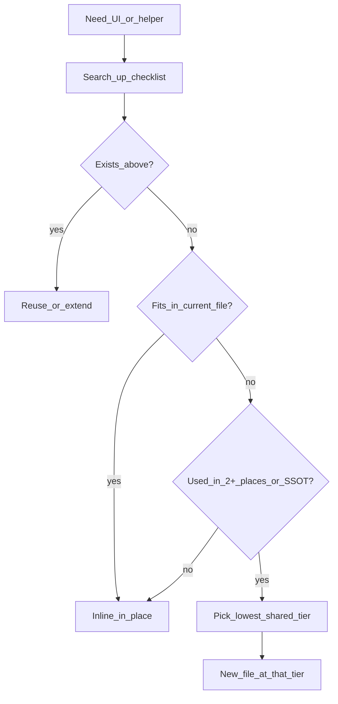

# Architecture & layout

> **Context:** Rule `.cursor/rules/architecture.mdc` on `src/app`, `src/lib`, `src/components`. Canonical detail here.

## Stack & template scope

|                  |                                                                                                                      |
| ---------------- | -------------------------------------------------------------------------------------------------------------------- |
| **Stack**        | Next.js 16+ App Router + `cacheComponents`, Prisma 7+, Better Auth v1 (org plugin), shadcn/Base UI, **action-first** |
| **Goal**         | Reusable auth + org/team dashboard; CLI may inject optional slices into the same paths                               |
| **In scope**     | Auth, sessions, orgs, teams, members, invitations, dashboard notifications, `/join/[invitationId]`                   |
| **Out of scope** | Product-only Prisma/UI not in the auth dashboard slice                                                               |
| **Schema**       | Better Auth baseline in Prisma; additive customizations only                                                         |

Dashboard navigation and copy: [dashboard.md](./dashboard.md). UI primitives: [ui-design.md](./ui-design.md).

## Placement {#placement}

**Default:** inline in the file you are editing. **Create a new file only** when logic or markup is reused or is segment SSOT.

### Search-up checklist (in order)

1. Same sub-feature `components/` (beside `page.tsx`)
2. Parent route `components/` (e.g. `organizations/.../manage/components/` when only that subtree shares it)
3. Segment `src/app/<segment>/components/` (e.g. `dashboard/components/form-shell/`)
4. App `src/components/` (outside `ui/`)
5. Compose `src/components/ui/*` (shadcn — do not hand-edit)
6. Only then add new code at the **lowest** tier that fits reuse

### Scope table

| Scope        | Location                                | Examples                                         |
| ------------ | --------------------------------------- | ------------------------------------------------ |
| Sub-feature  | beside route                            | columns, row menus, feature form fields          |
| Parent route | `…/<route>/components/`                 | combobox shared within `manage/` only            |
| Segment      | `src/app/<segment>/lib/`, `components/` | `dashboard-routes`, `DashboardFormShell`         |
| App          | `src/lib/`, `src/components/`           | `auth-session.ts`, `DashboardTableShell`, badges |

**Dependencies:** sub-feature → segment `lib/` → `src/lib` \| `src/components`. No imports from sibling features (e.g. `members/` must not import `teams/` internals). Cross-feature only via segment contracts (`*-routes.ts`, `cache-tags.ts`, access helpers).

### Decision flow



### Repo examples

| Pattern             | Location                                                                       |
| ------------------- | ------------------------------------------------------------------------------ |
| Segment shell       | `dashboard/components/form-shell/` (`DashboardFormShell`)                      |
| App-wide table      | `src/components/dashboard-table/` (`DashboardTableShell`)                      |
| Manage subtree only | `organizations/.../manage/components/` (`OrganizationMembersMultiCombobox`)    |
| Stay local          | `account/components/account-profile-form-fields.tsx`, `*-row-actions-menu.tsx` |

## Layout tree

```
src/
  lib/                    # auth, prisma, auth-session
  components/             # app-wide UI (not ui/)
  app/
    action/<segment>/     # mirrors app/<segment>/; one mutation per file
    api/                  # Better Auth + read-only GET (not mutations)
    dashboard/
      lib/                # *-routes.ts, cache-tags.ts
      components/
      …
    join/
    (auth)/
```

**Action-first:** writes in `action/` (e.g. `action/dashboard/organizations/manage/members/` ↔ `dashboard/organizations/[organizationId]/manage/members/`). No mutation Route Handlers — `api/` is auth + read-only fetches only.

## SSOT files

| Kind               | Where                                                           |
| ------------------ | --------------------------------------------------------------- |
| URLs               | `*-routes.ts` per segment — no hardcoded paths in pages/actions |
| Cache tags         | `cache-tags.ts` per segment                                     |
| Dashboard nav copy | `dashboard-nav-labels.ts` — [dashboard.md](./dashboard.md)      |
| Badge copy         | `src/lib/badge-labels.ts`                                       |

## Do not over-extract {#do-not-over-extract}

**Inline** one-offs and ~10–20 line snippets. **No** thin wrappers that only re-export or rename (`toast`, lodash, shadcn).

**Extract** when the same non-trivial UI or logic appears in **two or more** call sites, or the segment needs true SSOT (`*-routes.ts`, `cache-tags.ts`, `dashboard-nav-labels.ts`).

| Avoid                                      | Prefer                                         |
| ------------------------------------------ | ---------------------------------------------- |
| `dashboardToast.success` wrapping Sonner   | `toast.success` at the call site               |
| Many single-field files for one small form | One shell + local fields file                  |
| Generic row-actions abstraction            | `member-row-actions-menu.tsx` beside its table |

## CLI-ready modularity

1. Copy/merge `src/app/dashboard/<entity>/...` + `src/app/action/dashboard/...`.
2. Register `dashboard-routes.ts`, `dashboard-nav-labels.ts`, `cache-tags.ts`.
3. No cross-imports between sibling features. To remove a slice: delete route tree, matching actions, and unused nav keys.
